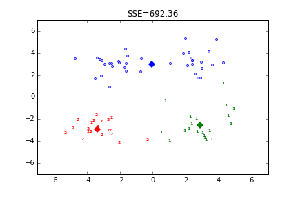
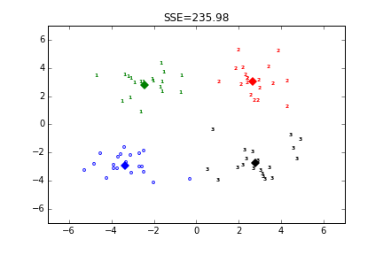
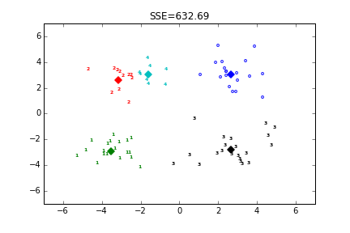

## Kmeans聚类（Python实现）

目录说明：

- data：存放数据集
- result：对数据集进行聚类的结果，分别是k为3,4,5的结果
- kmeans.py：K均值聚类的实现，包含两个，一个是Kmeans，一个是二分K-means
- run.py：一个测试文件，用于测试./data/test.txt文件


参考博文：[机器学习算法-K-means聚类](http://www.csuldw.com/2015/06/03/2015-06-03-ml-algorithm-K-means/)

使用工具：python + numpy + matplotlib + pandas

scikit-learn链接：[#k-means](http://scikit-learn.org/stable/modules/clustering.html#k-means)


## K-means原理
1. 创建k个点作为k个簇的起始质心（经常随机选择）。
- 分别计算剩下的元素到k个簇中心的相异度（距离），将这些元素分别划归到相异度最低的簇。
- 根据聚类结果，重新计算k个簇各自的中心，计算方法是取簇中所有元素各自维度的算术平均值。
- 将D中全部元素按照新的中心重新聚类。
- 重复第4步，直到聚类结果不再变化。
- 最后，输出聚类结果。

## 二分K-means原理
1.  从输入的数据点集合中随机选择一个点作为一个聚类中心
- 对于数据集中的每一个点x，计算它与最近聚类中心(指已选择的聚类中心)的距离D(x)
- 选择一个新的数据点作为新的聚类中心，选择的原则是：D(x)较大的点，被选取作为聚类中心的概率较大
- 重复2和3直到k个聚类中心被选出来
- 利用这k个初始的聚类中心来运行标准的k-means算法


## 测试用例

```
import pandas as pd
import numpy as np
from kmeans import KMeansClassifier
import matplotlib.pyplot as plt

#加载数据集，DataFrame格式，最后将返回为一个matrix格式
def loadDataset(infile):
    df = pd.read_csv(infile, sep='\t', header=0, dtype=str, na_filter=False)
    return np.array(df).astype(np.float)

if __name__=="__main__":
    data_X = loadDataset(r"data/testSet.txt")
    k = 3
    clf = KMeansClassifier(k)
    clf.fit(data_X)
    cents = clf._centroids
    labels = clf._labels
    sse = clf._sse
    colors = ['b','g','r','k','c','m','y','#e24fff','#524C90','#845868']
    for i in range(k):
        index = np.nonzero(labels==i)[0]
        x0 = data_X[index, 0]
        x1 = data_X[index, 1]
        y_i = i
        for j in range(len(x0)):
            plt.text(x0[j], x1[j], str(y_i), color=colors[i], \
                        fontdict={'weight': 'bold', 'size': 6})
        plt.scatter(cents[i,0],cents[i,1],marker='x',color=colors[i],\
                    linewidths=7)
    
    plt.title("SSE={:.2f}".format(sse))
    plt.axis([-7,7,-7,7])
    outname = "./result/k_clusters" + str(k) + ".png"
    plt.savefig(outname)
    plt.show()
```

## 结果展示

K-means算法结果如下图所示：

- 当k=3时的结果

<center>

</center>

- 当k=4时的结果

<center>

</center>

- 当k=5时的结果

<center>

</center>
