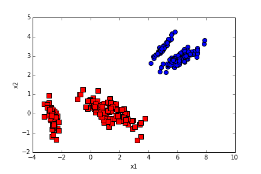

博文：http://www.csuldw.com/2016/01/22/2016-02-28-pca/

PCA（principle component analysis） ，主成分分析，主要是用来降低数据集的维度，然后挑选出主要的特征。原理简单，实现也简单。关于原理公式的推导，本文不会涉及，因为有很多的大牛都已经谢过了，这里主要关注下实现，算是锻炼一下自己。


## PCA思想

 移动坐标轴，将n维特征映射到k维上（k<n），这k维是全新的正交特征。这k维特征称为主元，是重新构造出来的k维特征，而不是简单地从n维特征中去除其余n-k维特征。

说到PCA难免会提到LDA（linear discriminate analysis，线性判别分析），以及FA（factor analysis，因子分析）。关于LDA，打算有时间也用代码实现一遍，下面给出它的主要思想。

区别：PCA选择样本点投影具有最大方差的方向，LDA选择分类性能最好的方向。

## 基本步骤


基本步骤：

- 对数据进行归一化处理（代码中并非这么做的，而是直接减去均值）
- 计算归一化后的数据集的协方差矩阵                   
- 计算协方差矩阵的特征值和特征向量
- 保留最重要的k个特征（通常k<n），可以自己制定，也可以选择个阈值，让后通过前k个特征值之和减去后面n-k个特征值之和大于这个阈值，找到这个k
- 找出k个特征值对应的特征向量
- 将m * n的数据集乘以k个n维的特征向量的特征向量（n * k）,得到最后降维的数据。

## 源码实现

见 pca.py文件

## 测试方法

测试方法写入main函数中，然后直接执行main方法即可：

data.txt可到github中下载：[data.txt](https://github.com/csuldw/MachineLearning/tree/master/PCA/data.txt)

```
#根据数据集data.txt
def main():    
    datafile = "data.txt"
    XMat = loaddata(datafile)
    k = 2
    return pca(XMat, k)
if __name__ == "__main__":
    finalData, reconMat = main()
    plotBestFit(finalData, reconMat)
```

## 结果展示

最后的结果图如下：

<center>

</center>

蓝色部分为重构后的原始数据，红色则是提取后的二维特征！


## 参考文献

[1] http://www.cnblogs.com/jerrylead/archive/2011/04/18/2020209.html  
[2] [Wikipedia- Linear discriminant analysis](https://en.wikipedia.org/wiki/Linear_discriminant_analysis)  
[3] [Wikipedia- Principal_component_analysis](https://en.wikipedia.org/wiki/Principal_component_analysis)


## Contributor

作者：刘帝伟  
主页：http://www.csuldw.com